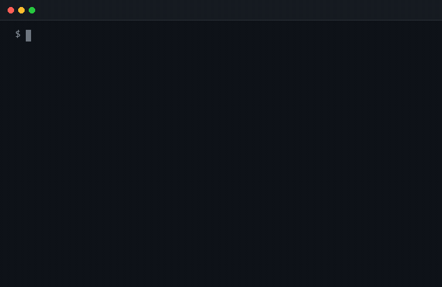

# flakesieve

**Know which CI failures are real.** flakesieve watches your test history and tells you, right in the pull request, whether a failure is your bug or a known flake.

No account. No database. No vendor. Your test history lives in your repo.

<!-- TODO: replace with the demo GIF. This is the single highest-leverage asset in this README.
     Record: a PR with a red X → flakesieve comment appears → "known flake, 37% over 200 runs" → merge. -->


```yaml
# .github/workflows/test.yml
- uses: flakesieve/flakesieve-action@v1
  if: always()
  with:
    report-paths: '**/junit.xml'
```

That's the whole setup.

---

## The problem

Your CI goes red. You didn't break anything — it's that one test that fails 4% of the time. So you re-run the job. It passes. You merge.

You just spent eleven minutes and a context switch learning nothing.

Multiply by every engineer on the team, every day. Teams stop trusting the test suite, start reflexively hitting re-run, and eventually a *real* failure slips through because everyone assumed it was the usual noise.

Tools that solve this exist. They're all SaaS: Trunk, BuildPulse, Datadog CI Visibility, Launchable. You send them your test data, you pay per seat, and your build history lives on someone else's servers.

flakesieve does the same job with a workflow file and a JSON file in your repo.

## What it does

When a test fails on a PR, flakesieve looks at what that same test has done across your recent runs on the default branch and sorts the failures into three buckets:

- 🔴 **Likely real** — this test has never failed before. Look at it.
- 🟡 **Known flake** — it fails intermittently regardless of the change. Not you.
- ⚫ **Already broken** — it's been failing on main since before this PR. Not you either.

The strongest signal it uses is a **same-SHA contradiction**: the same test, on the same commit, passing in one run and failing in another. That isn't a heuristic — it's proof the test is non-deterministic.

## Example output

```
  flakesieve  ·  184 runs analyzed  ·  1,246 tests tracked

  🔴 Likely real failures (1)
     checkout/CartTotals › applies bulk discount over 10 units
        first failure ever seen in 184 runs

  🟡 Known flakes (2)
     auth/SessionSpec › refreshes token near expiry
        fails 37% of runs · 12 same-commit contradictions · PPFPPPFPFPPP
     search/IndexerSpec › reindexes within timeout
        fails 8% of runs · 3 same-commit contradictions · PPPPPPPFPPPP

  ⚫ Already broken on main (1)
     billing/InvoiceSpec › emits EU VAT line
        failing for 23 consecutive runs since a1b2c3d
```

The PR comment renders the same information as a table. See [docs/pr-comment-format.md](docs/pr-comment-format.md) for the exact spec.

## Why there's no server

Flake detection needs history across runs, which is why every existing tool is a hosted service with a database. flakesieve stores that history as a single JSON file on a dedicated orphan branch (`flakesieve-history`), written by CI after each run on your default branch.

- Nothing leaves your infrastructure.
- History is versioned, diffable, and yours.
- Deleting the branch resets it. That's the whole uninstall.

Details and trade-offs: [docs/history-storage.md](docs/history-storage.md).

## Works with your stack

flakesieve reads **JUnit XML**, which nearly every test runner emits:

| Ecosystem | How |
|---|---|
| pytest | `--junitxml=junit.xml` |
| Jest / Vitest | `jest-junit`, `vitest --reporter=junit` |
| Go | `gotestsum --junitfile junit.xml` |
| JUnit / Gradle / Maven | emitted by default |
| RSpec | `rspec_junit_formatter` |
| PHPUnit | `--log-junit junit.xml` |
| .NET | `dotnet test --logger junit` |

Native parsers for other formats are a great first contribution — see below.

## CLI

```bash
npx flakesieve analyze --report "**/junit.xml" --history .flakesieve/history.json
```

```bash
npx flakesieve stats --top 20
```

## Status

**Early.** The core analysis engine and JUnit parser work and are tested. The GitHub Action wrapper is scaffolded but not yet published to the Marketplace. Interfaces may shift before `v1`.

Roadmap:

- [x] JUnit XML parsing
- [x] Flake classification (same-SHA contradictions + historical rate)
- [x] PR comment + terminal renderers
- [ ] GitHub Action published to Marketplace
- [ ] Orphan-branch history store
- [ ] Auto-quarantine (`--quarantine` exit code so known flakes don't fail the build)
- [ ] GitLab CI / Buildkite / CircleCI adapters
- [ ] Coverage-based test selection — run only tests affected by the diff

## Contributing

The best entry points are **report parsers** and **CI adapters** — each is one self-contained file with a clear interface and no need to understand the rest of the codebase. See [CONTRIBUTING.md](CONTRIBUTING.md) and the [good first issues](docs/good-first-issues.md).

## License

MIT
